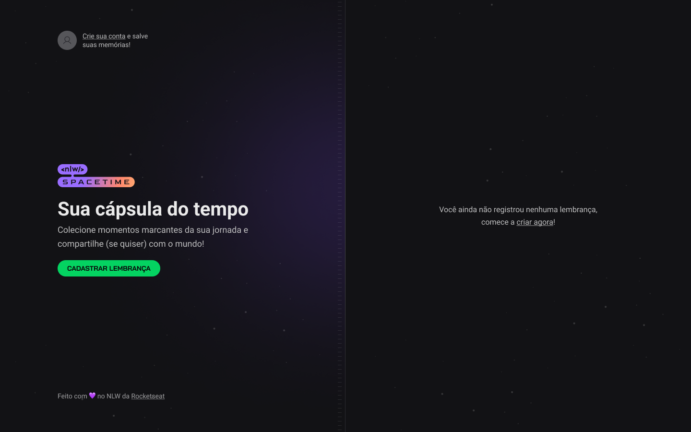
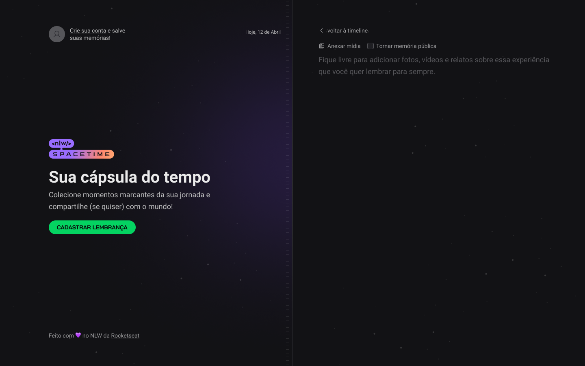
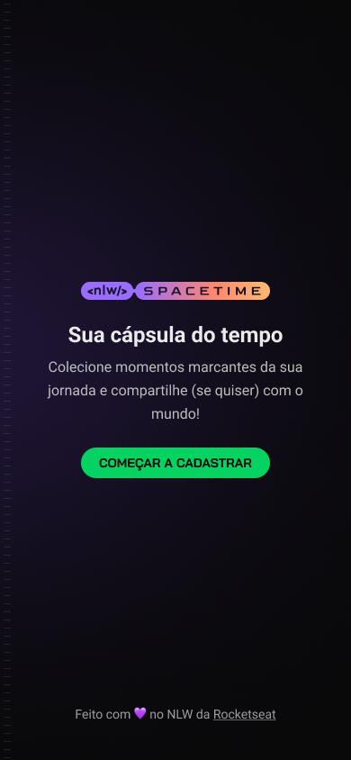
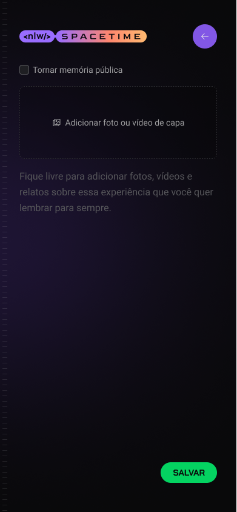
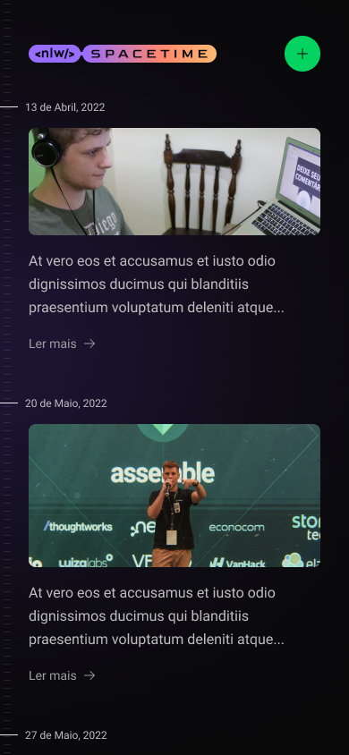

<p align="center">
  
</p>

## Spacetime

Spacetime platform to remember memory, where the user can add texts, photos and videos of important events in his life to a timeline, organized by month and year (web and mobile platform)

### Habits - web app

Home screen without registration and no memory created



Screen to register a memory where you can attach a media of up to 5MB and you decide whether you can make the memory public or not and describe a little about that memory



Screen where the memoirs will be presented and on them, each memoir has its date of when it was published.


Where is it to register user as soon as you authenticate via github get the clientID it will present your name and your github avatar as your registration.

### Habits - mobile application


|                           Splash Screen                           |                              Home                               |                       Memory screen                       |
| :---------------------------------------------------------------: | :-------------------------------------------------------------------: | :-------------------------------------------------------------: |
|  |  |  |

Screen where the memories registered and saved in the application's database will be displayed, with the option of creating another memory.



## installation

Before starting, you will need to have the following tools installed on your machine:
[Git](https://git-scm.com), [Node.js](https://nodejs.org/en/).
Also it's nice to have an editor to work with the code like [VSCode](https://code.visualstudio.com/).

> ⚠ Before running the frontend and mobile check the IP of your machine and configure it in the axios setup file present in the lib folder of the respective projects

### 🎲 Running the Back End (server)

```bash
# Clone this repository
$ git clone git@github.com:Caique017/Spacetime.git

# Access project folder in terminal/cmd
$ cd Spacetime

# Go to server folder
$ cd server

# install the dependencies
$ npm install
# If you prefer to use Yarn, run the command below
$ yarn

# Run the application in development mode
$ npm run dev
# If you prefer to use Yarn, run the command below
$ yarn dev

# The server will start on port 3333 - go to <http://localhost:3333>
```

### 🖥️ Rodando o Front End (Web)

```bash
# Clone this repository
$ git clone git@github.com:Caique017/Spacetime.git

# Access project folder in terminal/cmd
$ cd Spacetime

# Go to web folder
$ cd web

# install the dependencies
$ npm install
# If you prefer to use Yarn, run the command below
$ yarn

# Run the application in development mode
$ npm run dev
# If you prefer to use Yarn, run the command below
$ yarn dev

# The server will start on port 5173 - go to <http://localhost:5173>
```

### 📱 Running the App (Mobile)

```bash
# Clone this repository
$ git clone git@github.com:Caique017/Spacetime.git

# Access project folder in terminal/cmd
$ cd Spacetime

# Go to mobile folder
$ cd mobile

# install the dependencies
$ npm install
# If you prefer to use Yarn, run the command below
$ yarn

# run the application
$ yarn start

# The Expo menu will open in the terminal where you can scan the QR Code to run the app directly on your cell phone or the options to run it on the android or iOS emulator
```

## Technologies

[](https://skillicons.dev)...
